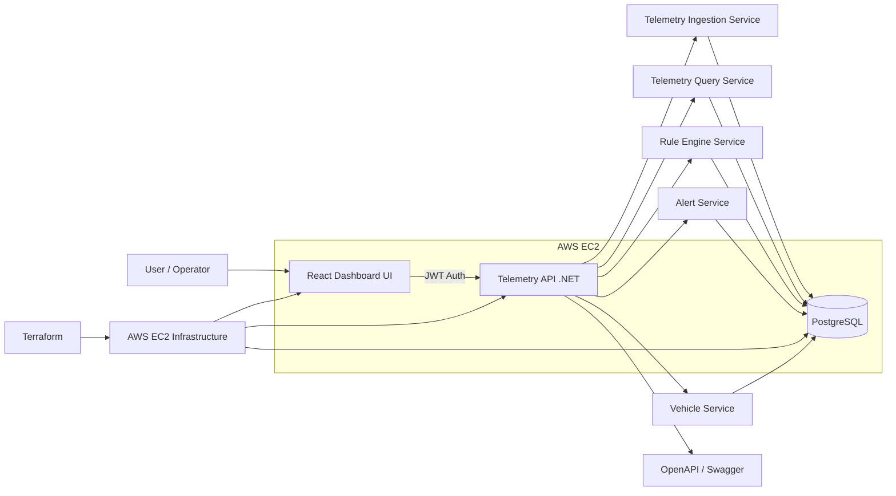
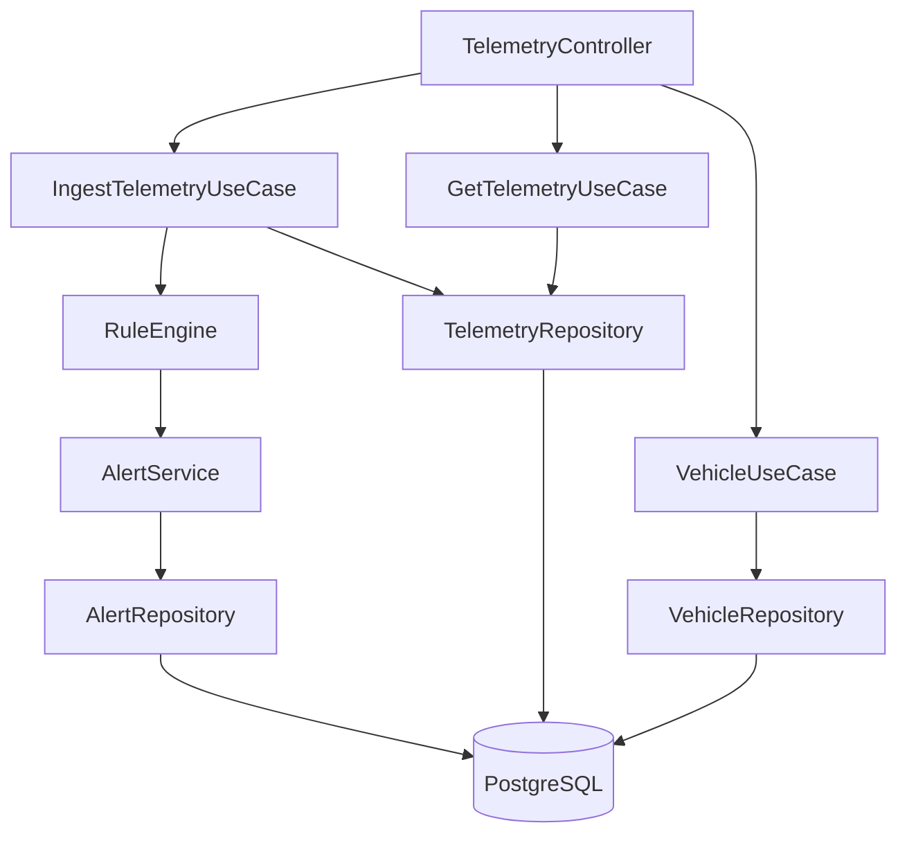
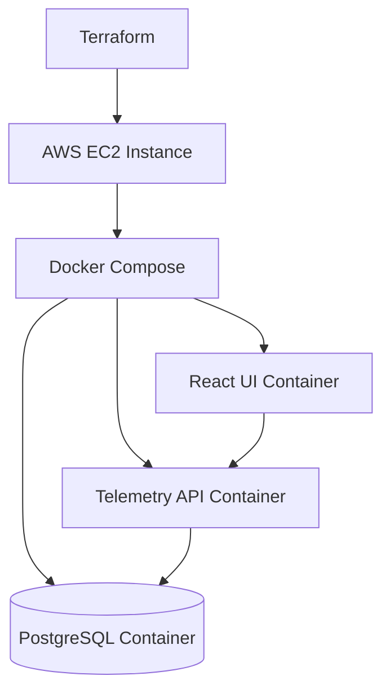

# Telematics Platform

A multi-tenant telemetry monitoring platform capable of processing vehicle telemetry and generating alerts based on configurable rules.

## Backend

- ASP.NET Core
- PostgreSQL
- Docker

## Frontend
- Vite with React

## Architecture
- Clean Architecture for the Backend
- Feature-Based Architecture for the UI

## Features
- Vehicle telemetry ingestion
- Rule-based alerting
- Fleet monitoring dashboard
- Multi-tenant architecture
- Terraform + AWS + Docker Deployment

## Final goal architecture
Telemetry Platform

- Vehicles API
- Telemetry Ingestion
- Telemetry Query API
- Rule Engine
- Alert Engine
- Alert Query API
- Rule Management API
- JWT and RBAC Auth
- Dashboard UI

## System Architecture

## Backend Component Diagram 

## Deployment Diagram
