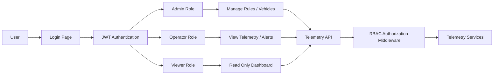

# Telematics Platform

UI for the telematics platform app

## Frontend
- Vite with React

## Architecture
- Feature-Based Architecture 

## RBAC + JWT Diagram

```mermaid
flowchart LR

User --> Login[Login Page]

Login --> Auth[JWT Authentication]

Auth --> Admin[Admin Role]
Auth --> Operator[Operator Role]
Auth --> Viewer[Viewer Role]

Admin --> AdminUI[Manage Rules / Vehicles]
Operator --> OperatorUI[View Telemetry / Alerts]
Viewer --> ViewerUI[Read Only Dashboard]

AdminUI --> API[Telemetry API]
OperatorUI --> API
ViewerUI --> API

API --> RBAC[RBAC Authorization Middleware]

RBAC --> Services[Telemetry Services]
```